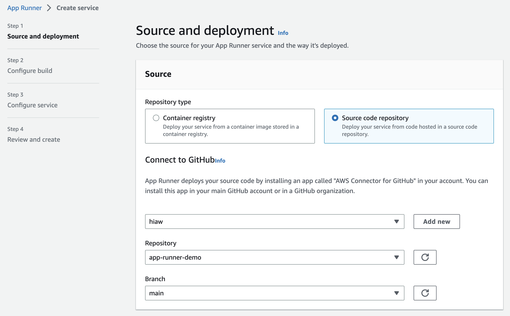
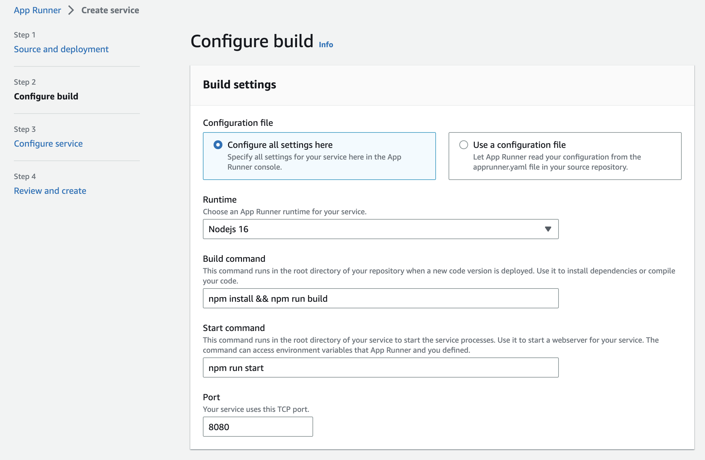
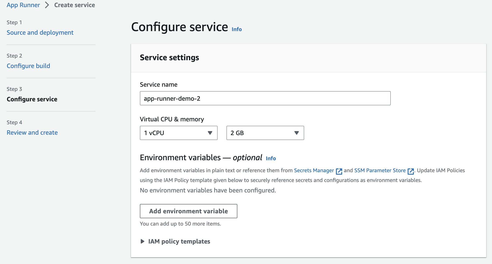

# AWS App Runner Demo

This is a simple web server demo app for demonstating AWS App Runner.

## Presentation

This is the [link](https://docs.google.com/presentation/d/1CNzq3MmxR9t7b43ZXqfnOsN3bwhWcieTBAmXjsuA2os/edit?usp=sharing) to the meetup presentation.

## Get Started

```
npm install
npm run build
npm run start
```

Then navigate to http://127.0.0.1:8080

## AWS Console

Go to AWS App Runner in the AWS Console. Create a new AppRunner.



Select `Node 16` and enter the build and run command.



Next step is to configure the service name. The rest can be left as default.



The create and deploy the last step.
